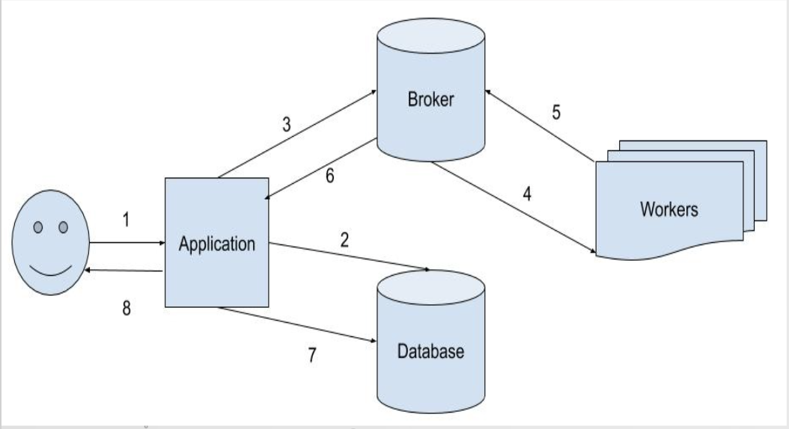

# ACC-Mini-Project

In this project, we use Celery as workers, RabbitMQ as the broker, Flask as the application and  MariaDB as the database. How the overall service workflow works can be seen in figure below.

<div style="text-align:center"></div>

Run Celery and RabbitMQ with Docker, and generate worker clusters

steps.sh is used to prepare meshes for calculation and make airfoil available for execution

convert.py is used to convert all .msh files into .xml files

To run the project, enter celery folder and do following commands
```bash
docker-compose build

docker-compose up --scale worker=2
docker exec -it docker_worker_1 /bin/bash
docker exec -it docker_worker_2 /bin/bash
...
```
OR
```bash
docker-compose run rabbit
docker-compose run worker
docker-compose run worker
...
docker exec -it docker_worker_run_1 /bin/bash
docker exec -it docker_worker_run_2 /bin/bash
...
```
The number of worker is changeable. Run 
```bash
python3 run.py mesh_xml/NAME_OF_A_MESH_XML_FILE
```
to distribute tasks in different worker containers start working on RabbitMQ solver.

There's gonna be 2 worker docker containers and 1 solver docker container with the calculation solving on RabbitMQ server.
